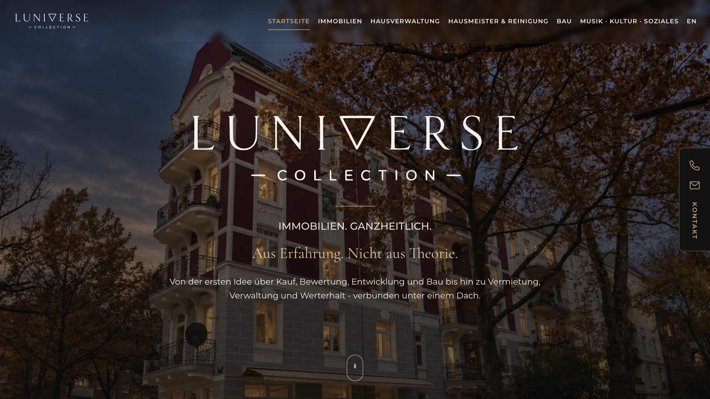

# Moe

**Web projects · Practical automation · Developer tools**

I work on websites, automation and tools that solve practical problems.
My recent work includes LUNIVERSE Collection and improvements to tools for
creating animations with JavaScript.

## LUNIVERSE Collection

A website for LUNIVERSE Collection in German and English, built with Next.js and TypeScript.
The project includes responsive layouts, image optimisation, contact forms
and deployment on Netlify.

[Visit the website](https://luniverse-collection.com) · Source code is private.

## Tooling and fixes

**Animation tooling.** I use and adapt open-source workflows for films drawn
with JavaScript and Canvas. The [vendored skills](./.claude/skills) are MIT-licensed
work by Alexey Fateev and Dean Kuhn, with provenance retained. My changes include a
[renderer fix with regression tests](https://github.com/alsharmani0/alsharmani0/pull/2)
that prevents old frames from appearing in shortened renders.

**OpenClaw debugging.** A collection of
[patches and issue notes](https://github.com/alsharmani0/openclaw-upstream-patches),
including a WhatsApp outbound-target fix and a regression test. These are
proposed changes, not merged upstream contributions.

Earlier projects

- [Service Watch Dashboard](https://github.com/alsharmani0/service-watch-dashboard) — a small HTTP status dashboard built with Node.js and vanilla JavaScript. [Demo](https://service-watch-dashboard.onrender.com/).
- [Atelier HeimW](https://github.com/alsharmani0/website-atelier-heimw) — a static website built with HTML and CSS. [Website](https://atelier-heimw.de).
- [sysinfo-cli](https://github.com/alsharmani0/sysinfo-cli) — a Python exercise in CLI packaging and system information.
- [Mini Homelab](https://github.com/alsharmani0/homelab-mini) — notes and example configuration from a small Linux lab.

