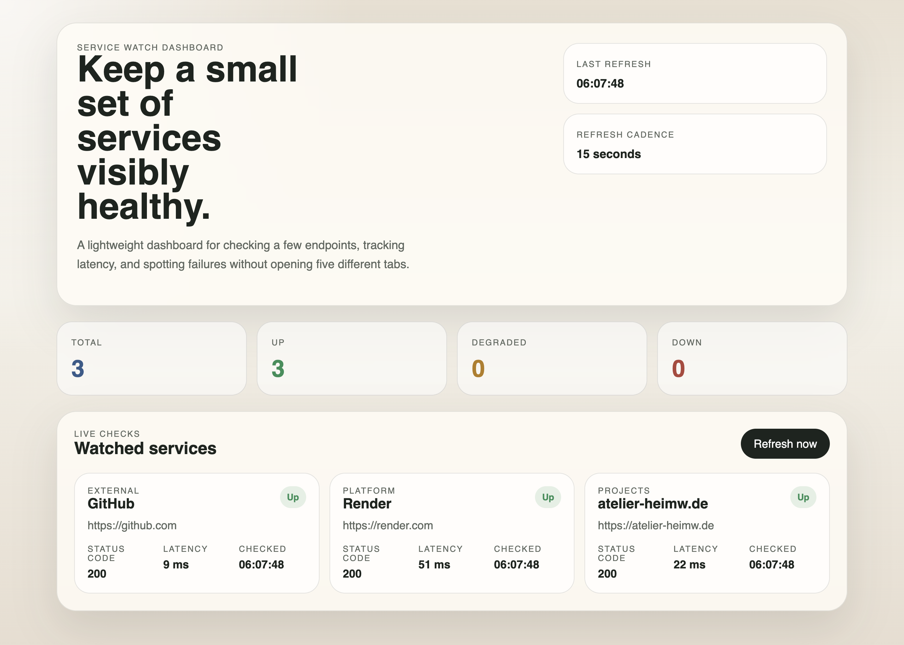

# Moe

**Linux · Web hosting · Developer tools**

I build small web apps, command-line tools and Linux setups. I like working
across the whole process: writing the code, getting it online and documenting
how to run it.

## Featured project

### [Service Watch Dashboard](https://github.com/alsharmani0/service-watch-dashboard)

A dashboard for checking current HTTP service health at a glance: status codes,
response times and up/degraded/down states, with automatic refresh. Built with
Node.js and vanilla JavaScript, with no third-party runtime dependencies.

[Live demo](https://service-watch-dashboard.onrender.com/) · [Source & setup](https://github.com/alsharmani0/service-watch-dashboard#running-locally)

## More projects

| Project | What I built |
| --- | --- |
| [Mini Homelab](https://github.com/alsharmani0/homelab-mini) | A documented two-server lab with an Ubuntu app server and a Rocky Linux NGINX gateway, covering systemd, SSH key-only access, firewalls and SELinux. |
| [Atelier HeimW](https://github.com/alsharmani0/website-atelier-heimw) | A responsive website for a local art atelier, built with HTML and CSS and hosted on Netlify. [Visit the site](https://atelier-heimw.de). |
| [sysinfo-cli](https://github.com/alsharmani0/sysinfo-cli) | A Python CLI that reports CPU, memory, disk and OS information as readable text or JSON. |

## Tools I work with

`Linux` `Ubuntu` `Rocky Linux` `NGINX` `systemd` `Python` `Node.js` `JavaScript` `HTML/CSS` `Git` `Netlify`

I also keep an [OpenClaw source patch and issue notes](https://github.com/alsharmani0/openclaw-upstream-patches)
with technical context for upstream review.
