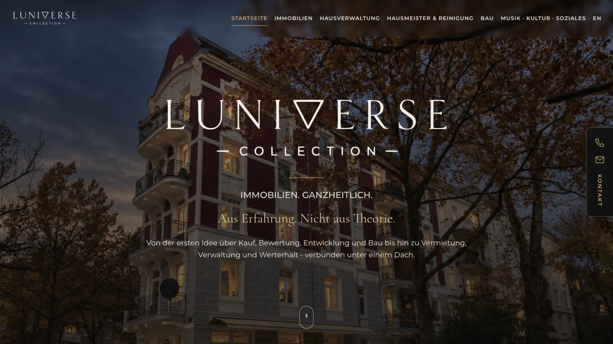

# Moe

**Web development · Linux and automation · Developer tools**

I build websites and practical tools, and I like the operations side too:
Linux servers, reverse proxies, deployment and CI.

**Stack:** TypeScript · Next.js · React · Node.js · HTML/CSS · Python ·
Linux · NGINX · GitHub Actions · Netlify

## LUNIVERSE Collection

A website for LUNIVERSE Collection in German and English, built with Next.js,
React and TypeScript as a static export on Netlify.

- German and English page trees with translated URLs, for example
  `/ueber-uns` and `/en/about-us`
- a build-time image pipeline with sharp that writes AVIF, WebP and JPEG in
  three widths and respects EXIF orientation
- contact forms on Netlify Forms with a confirmation page per language, and
  redirects to one canonical host

[Visit the website](https://luniverse-collection.com) · The source code is private.

## Belegsuche

Local search for receipts, invoices and scanned documents on macOS. Text
recognition runs on the Mac with Apple's Vision framework, and the index is
SQLite full-text search, so no document leaves the machine.

- search rules for German documents: amounts like `1.234,56 €`, invoice
  numbers in different spellings, `Müller` = `Mueller`, street abbreviations,
  compound words and typos
- incremental indexing that survives an unplugged drive and resumes where it
  stopped
- search quality measured on a generated test corpus with held-out queries,
  and 212 tests that run on macOS in CI

[Source code](https://github.com/alsharmani0/belegsuche)

## atelier-heimw.de

Website for a jewellery and workshop atelier in Eckernförde, live on its own
domain. Plain HTML and CSS, hosted on Netlify.

[Visit the website](https://atelier-heimw.de) · [Source code](https://github.com/alsharmani0/website-atelier-heimw)

## How I work

I use AI coding agents such as Claude Code and Codex. I set the requirements,
review every change and am responsible for what ships.
